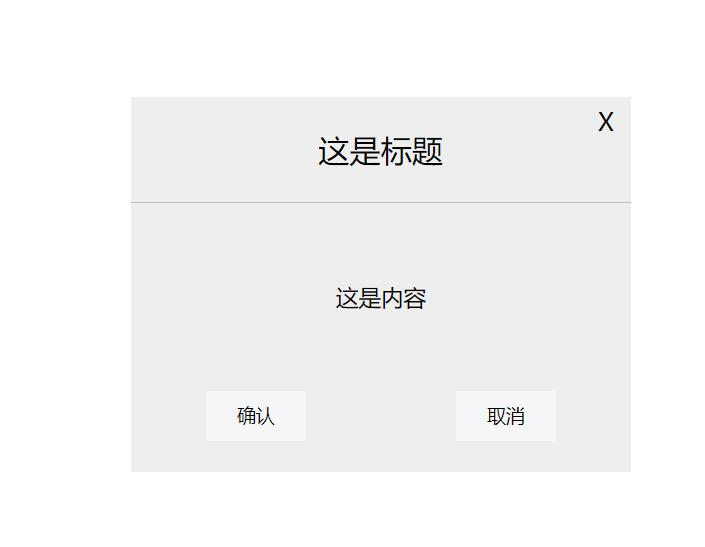

## 对话框组件效果说明
==================================

*本页面主要实现了点击确认按钮，自动生成div特效*
*内容可以实现点击效果和拖动效果*

### css部分
```
	.wrap{
		position:absolute;
	}
	i{
		display:inline-block;
		font-style:normal;
		width:20px;
		height:20px;
		font-size:20px;
		text-align:center;
		line-height:20px;
		position:absolute;
		right:10px;
		top:10px;
	}
	i:hover{
		color:#fff;
	}
	.header{
		width:100%;
		height:28%;
		border-bottom:1px solid #bbb;
		background-color:;
		font-size:25px;
		text-align:center;
		display:flex;
		justify-content:center;
		align-items:center;
	}
	.content{
		width:100%;
		height:50%;
		background-color:;
		font-size:18px;
		display:flex;
		justify-content:center;
		align-items:center;
	}
	.footer{
		width:100%;
		height:20%;
		background-color:;
		display:flex;
		justify-content:space-around;
	}
	.footer input{
		width:80px;
		height:40px;
		border:none;
		outline:none;
		background-color:#f6f6f9;
		font-size:15px;
	}

```

### html部分
```
	<input id="btn" type="button" value="点击">
	<!-- <div class="wrap">
		<i id="del">X</i>
		<div class="header">标题</div>
		<div class="content">内容</div>
		<div class="footer">
			<input id="affirm" type="button" value="确认">
			<input id="cancel" type="button" value="取消">
		</div>
	</div> -->
```

### html里js部分
```
	var obj={
		_w:"400",//宽
		_h:"300",//高
		_title:"这是标题",//标题
		_con:"这是内容",//内容
		_color:"#555",//字体颜色
		_bgcolor:"#eee",//背景颜色
	}
	
	//点击按钮
	btn.onclick=function(){
		btn.style.display="none";//隐藏按钮
		var frame=new Frame(obj);//创建对象
	}
```

### js部分
```
	//构造函数
	function Frame(obj){
		this.content=null;//内容为空
		this.mouseX=0;//鼠标X轴
		this.mouseY=0;//鼠标Y轴
		this.posX=0;//弹框X轴
		this.posY=0;//弹框Y轴
		this.isDrag=false;//默认不可以拖动
		this.maxWidth=document.clientWidth;//窗口宽
		this.maxHeight=document.clientHeight;//窗口高
		this.obj={//自定义属性
			width:obj._w,//宽
			height:obj._h,//高
			title:obj._title,//标题
			con:obj._con,//内容
			color:obj.color,//字体颜色
			bgcolor:obj._bgcolor,//背景颜色
		};
		this.addChild();//生成div
		this.move();//移动
		this.delete();//删除
	}

	//视口宽
	Frame.prototype.clientWidth=function(){
		return document.documentElement.clientWidth;
	}
	//视口高
	Frame.prototype.clientHeight=function(){
		return document.documentElement.clientHeight;
	}

	//生成DOM节点
	Frame.prototype.addChild=function(){
		this.dom=document.createElement("div");//创建div
		this.dom.className="wrap";//设置class
		this.dom.style.width=this.obj.width+"px";//设置宽
		this.dom.style.height=this.obj.height+"px";//设置高
		this.dom.style.color=this.obj.color;//设置字体颜色
		this.dom.style.background=this.obj.bgcolor;//设置背景颜色
		this.dom.style.left=(this.clientWidth()-this.obj.width)/2+"px";
		this.dom.style.top=(this.clientHeight()-this.obj.height)/2+"px";
		this.dom.innerHTML="<i id='del'>X</i><div class='header'>"+this.obj.title+"</div><div class='content'>"+this.obj.con+"</div><div class='footer'><input id='affirm' type='button' value='确认'><input id='cancel' type='button' value='取消'></div>";//内容
		
		document.body.appendChild(this.dom);//上树
	}

	//移动div时
	Frame.prototype.move=function(){
		var that=this;//备份
		
		//鼠标按下时
		this.dom.onmousedown=function(event){
			//console.log("按下鼠标");
			var event=event || window.event;
		
			that.mouseX=event.pageX;//点击鼠标时的X轴
			that.mouseY=event.pageY;//点击鼠标时的Y轴
			that.popX=that.dom.offsetLeft;//div左边
			that.popY=that.dom.offsetTop;//div上边
			
			that.isDrag=true;//可以拖动
		}
		
		//鼠标按下并移动时
		this.dom.onmousemove=function(event){
			//console.log("按下鼠标并开始移动");
			var event=event || window.event;
			
			var x=event.pageX;//移动时的x坐标
			var y=event.pageY;//移动时的y坐标
			
			//判断是否移动
			if(that.isDrag){
				var xx=that.popX+x-that.mouseX;//移动后的left
				var yy=that.popY+y-that.mouseY;//移动后的top
				
				that.dom.style.left=xx+"px";//X轴
				that.dom.style.top=yy+"px";//Y轴
			} 
		}
		
		//当鼠标离开时
		this.dom.onmouseup=function(){
			//console.log("鼠标离开");
			that.isDrag=false;//禁止移动
		}

	}

	//删除div
	Frame.prototype.delete=function(){
		var btn=document.getElementById("btn");//点击按钮
		var that=this;
		//点击X
		del.onclick=function(){
			console.log("删除");
			document.body.removeChild(that.dom);//删除wrap
			btn.style.display="block";//显示按钮
		}
		//点击确认
		affirm.onclick=function(){
			console.log("确认");
			document.body.removeChild(that.dom);//删除wrap
			btn.style.display="block";//显示按钮
		}
		//点击取消
		cancel.onclick=function(){
			console.log("取消");
			document.body.removeChild(that.dom);//删除wrap
			btn.style.display="block";//显示按钮
		}
	}
```

### 
#### 联系电话：666 8888 8888